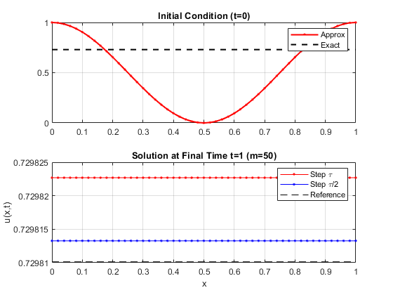
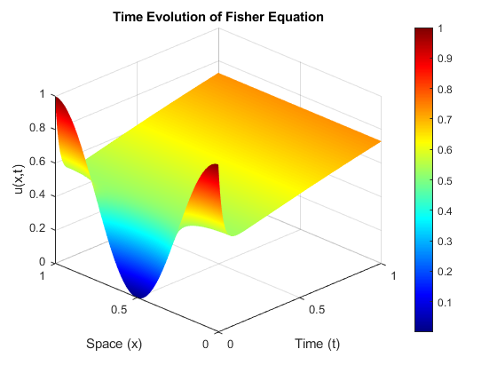

# Fisher-KPP Equation Solver (Rosenbrock Method)

## Overview
This repository contains a MATLAB implementation for numerically solving the **Fisher-KPP reaction-diffusion equation**:

$$\frac{\partial u}{\partial t} = D \nabla^2 u + r u(1-u)$$

This equation describes biological population dynamics and wave propagation in excitable media. The solver is designed to handle the **stiffness** introduced by the diffusion term using a semi-implicit method.

## Numerical Methods
* **Space Discretization**: Finite Difference Method (FDM) with Neumann Boundary Conditions.
* **Time Integration**: **1-Stage Rosenbrock Method**. Unlike explicit methods (e.g., Forward Euler) which require extremely small time steps for stability, this semi-implicit scheme is **L-stable**, allowing for efficient computation.
* **Linear Algebra**: Uses sparse matrix operations (`spdiags`) to optimize memory and speed for the Jacobian system solve ($Ax=b$).

## Key Features
* **Stiffness Handling**: Implements a Jacobian-based update to maintain stability.
* **Empirical Order of Convergence**: The script calculates the experimental convergence rate $p$ to validate the numerical consistency.
* **Visualization**: Generates 2D cross-sections and full 3D surface evolution plots.

## Results

### 1. Wavefront Propagation (2D)
Comparison between the numerical approximation (Rosenbrock) and the reference solution at $t=1$. The overlap confirms the method's accuracy.

### 2. Time Evolution (3D)
Full spatiotemporal evolution of the population density $u(x,t)$. Note the smooth transition despite the stiffness of the diffusion term.

## Usage
1.  Run `fisher_rosenbrock_solver.m` in MATLAB.
2.  Parameters for grid resolution ($m, n$) can be adjusted inside the script.
